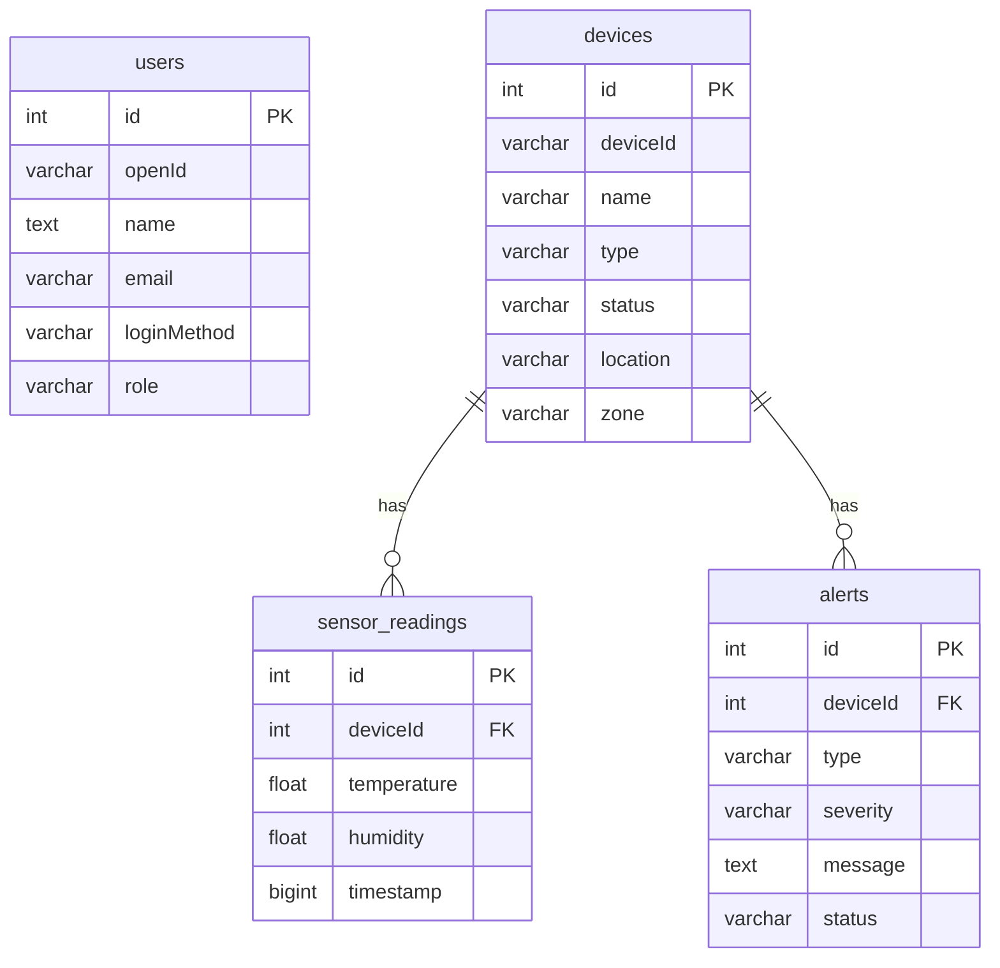

# Smart Factory IoT Dashboard - Design Document

**Version:** 2.0.0
**Author:** Andrew Gotora
**Email:** [andrewgotora@yahoo.com](mailto:andrewgotora@yahoo.com)

## 1. Introduction

### 1.1. Purpose

This document outlines the design and architecture of the Smart Factory IoT Dashboard, version 2.0.0. It details the system's structure, components, and the implementation of its core features, serving as a guide for development, maintenance, and future enhancements.

### 1.2. Scope

The scope of this document covers the architectural design, feature implementation details, database schema, and the application of SOLID principles for the following key features:

- Real-time WebSocket updates for sensor data.
- Email and SMS notifications for threshold-based alerts.
- Device grouping for batch operations and analytics.

### 1.3. System Overview

The Smart Factory IoT Dashboard is a web-based application designed to provide a centralized platform for monitoring and managing IoT devices in a manufacturing environment. The system comprises a frontend user interface, a backend server, a database, and a real-time communication layer, all working in concert to deliver a responsive and scalable solution.

## 2. System Architecture

### 2.1. Architectural Style

The system employs a client-server architectural style with a modular, service-oriented approach on the backend. This promotes a separation of concerns, allowing for independent development, deployment, and scaling of different parts of the application.

### 2.2. High-Level Architecture Diagram

```mermaid
graph TD
    A[Users] --> B{Frontend (React)};
    B --> C{Backend (Node.js/Express)};
    C --> D[Database (MySQL)];
    C --> E[WebSocket Server];
    E --> B;
    C --> F[Notification Service];
    F --> G[Email/SMS Gateway];
```

### 2.3. Component Breakdown

#### 2.3.1. Frontend

- **Framework:** React with TypeScript
- **UI:** TailwindCSS
- **State Management:** React Query
- **Build Tool:** Vite

#### 2.3.2. Backend

- **Framework:** Node.js with Express and tRPC
- **Language:** TypeScript
- **Services:** Modular services for WebSockets, notifications, and device grouping.

#### 2.3.3. Database

- **System:** MySQL (or compatible)
- **ORM:** Drizzle ORM

#### 2.3.4. Real-time Layer

- **Technology:** WebSockets (using the `ws` library)
- **Functionality:** Pushes real-time sensor data, alerts, and device status updates to connected clients.

## 3. Feature Design

### 3.1. Real-time WebSocket Updates

The WebSocket service (`websocket.ts`) establishes a persistent, bidirectional communication channel between the client and server. Clients subscribe to specific channels (e.g., for a particular device), and the server broadcasts messages to all subscribed clients when relevant events occur.

### 3.2. Email/SMS Notifications

The notification service (`notifications.ts`) is responsible for sending alerts. It is designed with a provider-based architecture, allowing for easy integration of different notification channels (e.g., SendGrid for email, Twilio for SMS). Configurations for notifications are stored and managed through a dedicated API.

### 3.3. Device Grouping

The device grouping service (`deviceGrouping.ts`) allows users to organize devices into logical groups. This feature supports batch operations and provides aggregated analytics for each group, simplifying the management of large numbers of devices.

## 4. Database Design

### 4.1. Schema Diagram



### 4.2. Data Models

The database schema is defined using Drizzle ORM in `/drizzle/schema.ts`. It includes tables for users, devices, sensor readings, alerts, and other related entities.

## 5. SOLID Principles Implementation

- **Single Responsibility Principle (SRP):** Each service (`websocket.ts`, `notifications.ts`, `deviceGrouping.ts`) has a single, well-defined responsibility.
- **Open/Closed Principle (OCP):** The notification service is open for extension (e.g., adding new providers) but closed for modification.
- **Liskov Substitution Principle (LSP):** The notification provider interface ensures that different provider implementations can be substituted without affecting the system's behavior.
- **Interface Segregation Principle (ISP):** The API endpoints are segregated based on functionality (e.g., devices, alerts, groups), so clients only need to interact with the parts of the API that are relevant to them.
- **Dependency Inversion Principle (DIP):** The use of an ORM (Drizzle) and dependency injection for services helps to decouple high-level modules from low-level implementation details.

## 6. Deployment and Scalability

### 6.1. Deployment Strategy

The application is designed to be containerized using Docker for consistent and reliable deployments. A multi-container setup (e.g., using Docker Compose) can be used to manage the application, database, and any other required services.

### 6.2. Scalability Considerations

The backend can be scaled horizontally by running multiple instances behind a load balancer. The WebSocket server can also be scaled, although this requires a more sophisticated setup with a message broker (e.g., Redis) to handle cross-instance communication.
