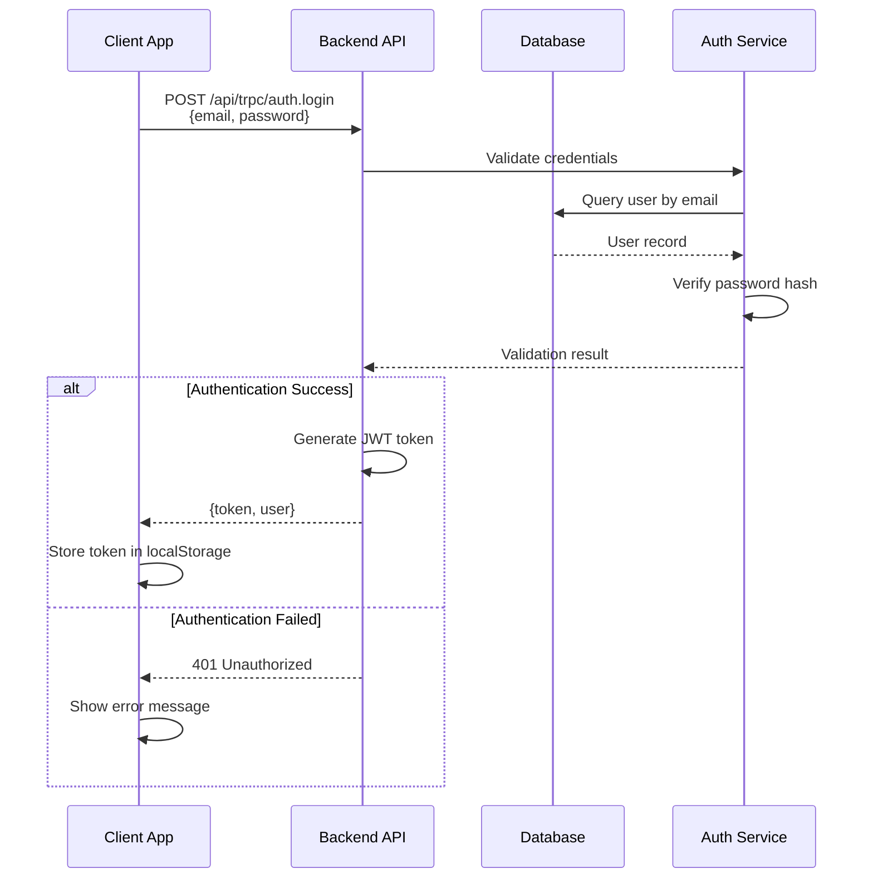
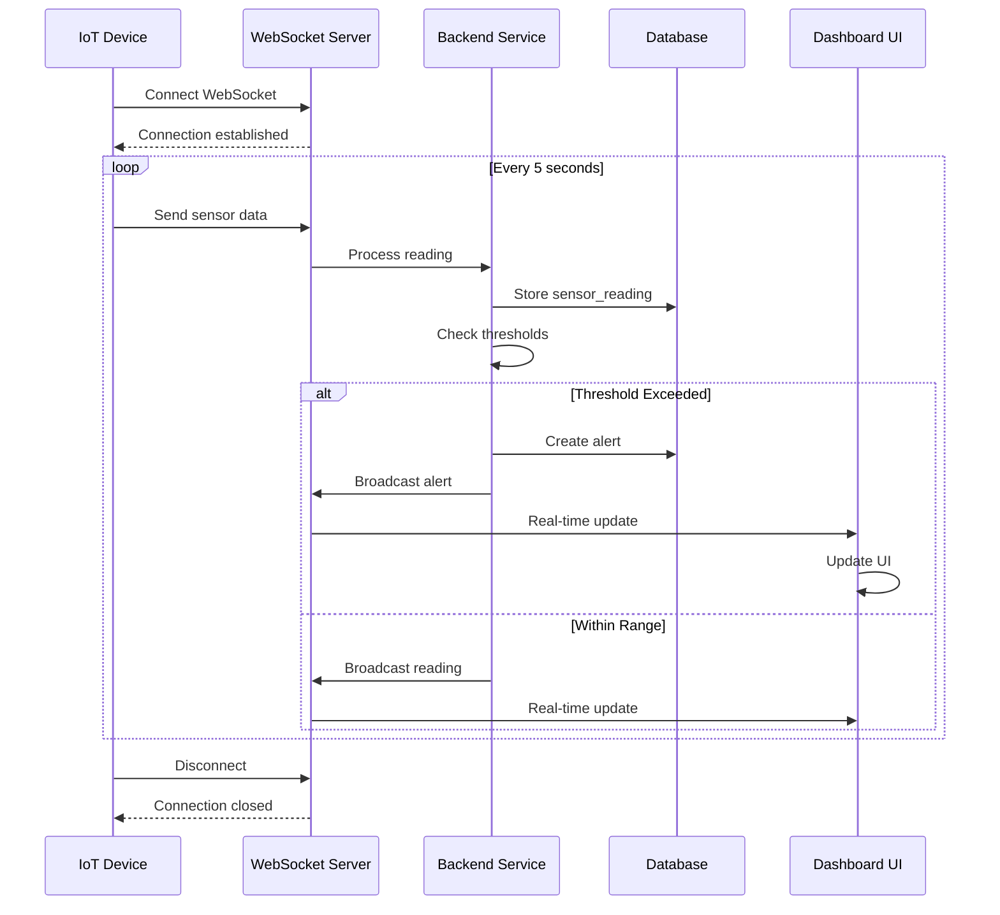
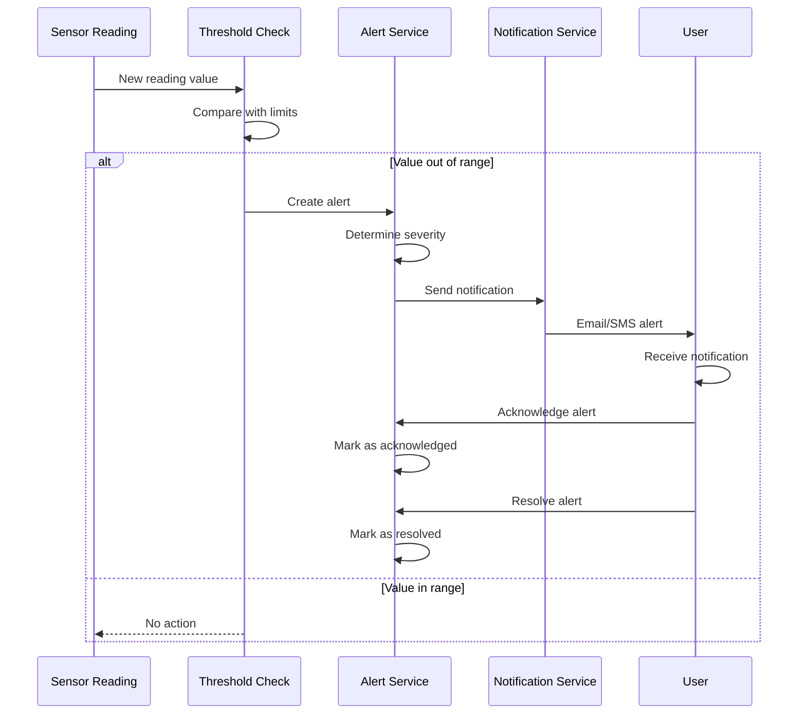
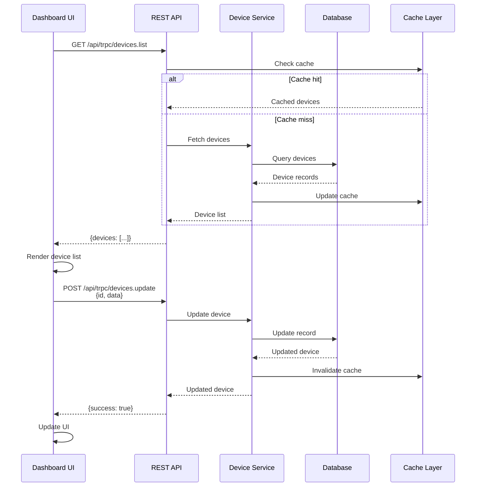
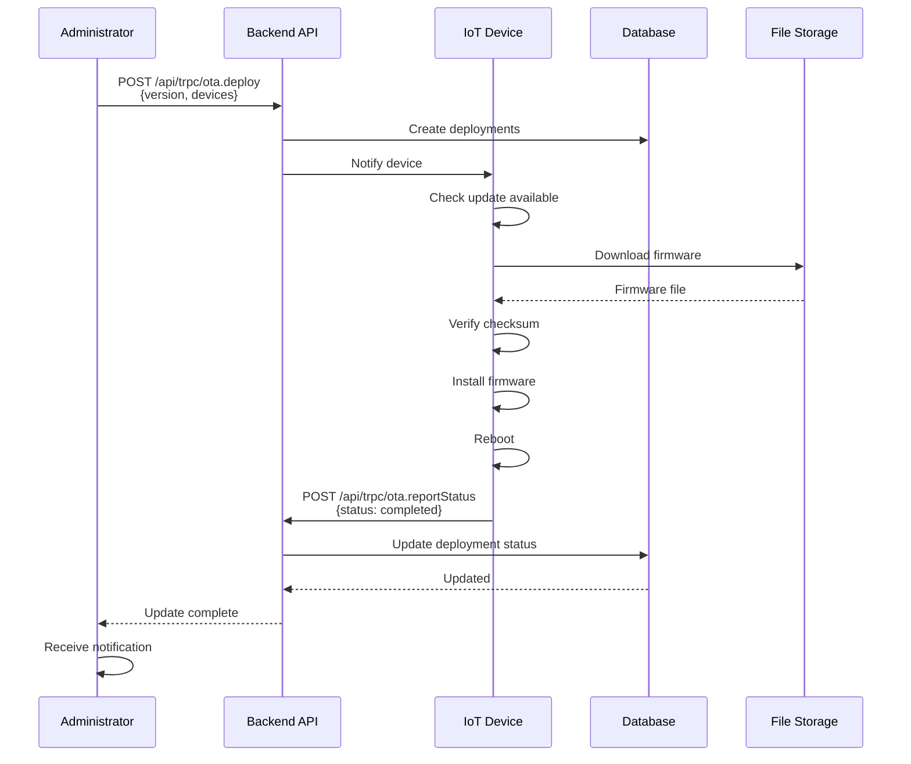
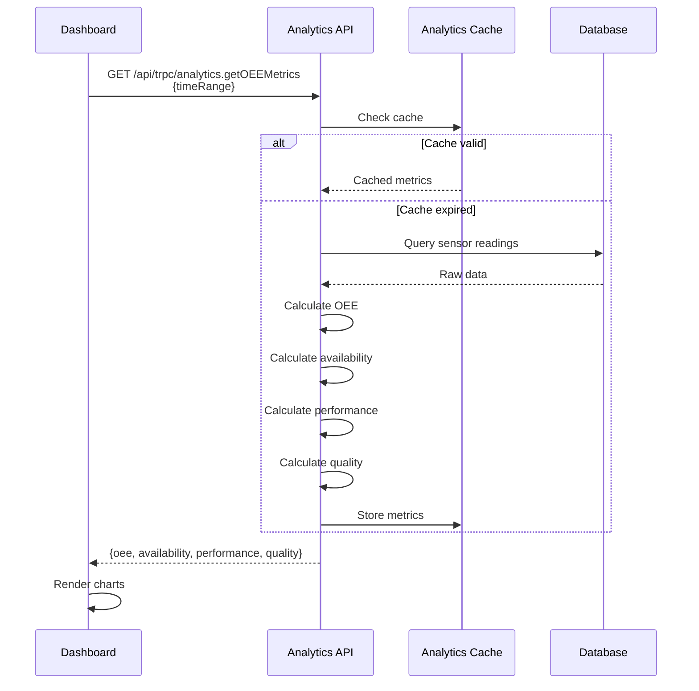
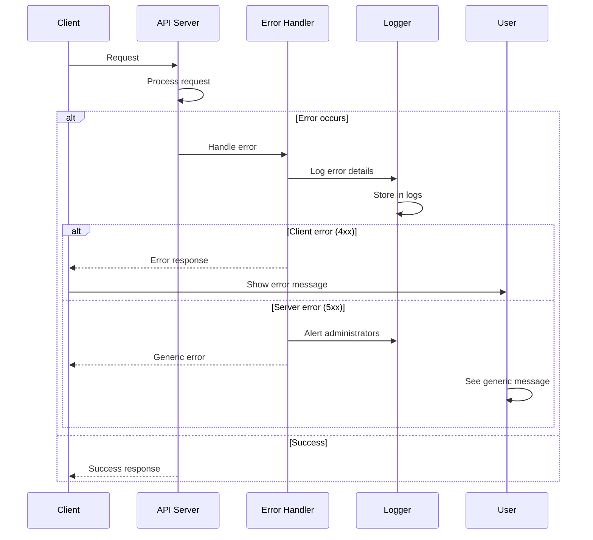
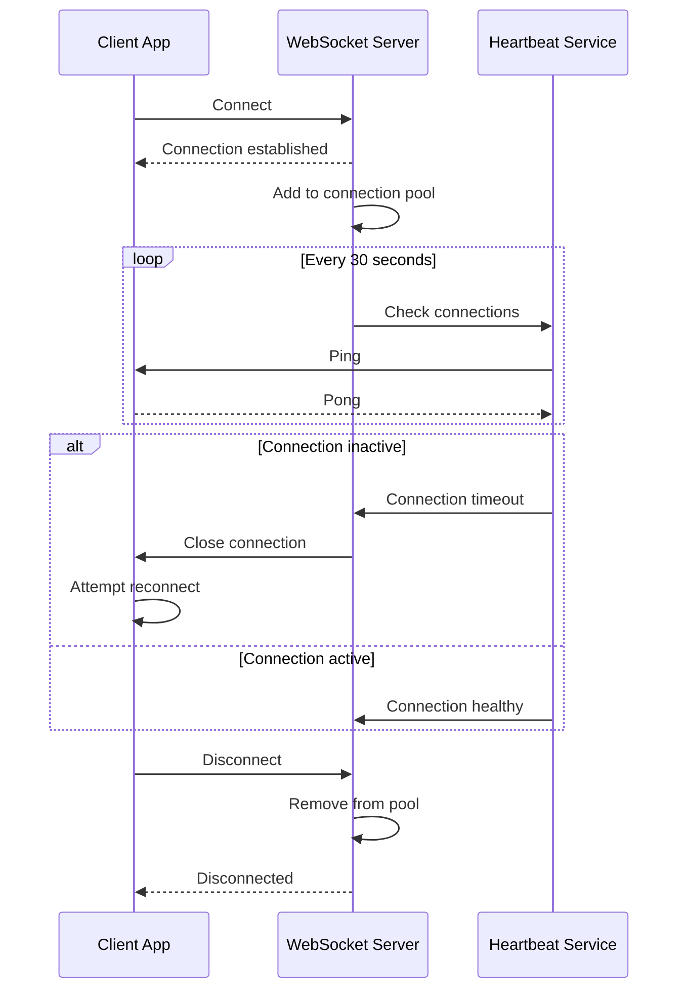
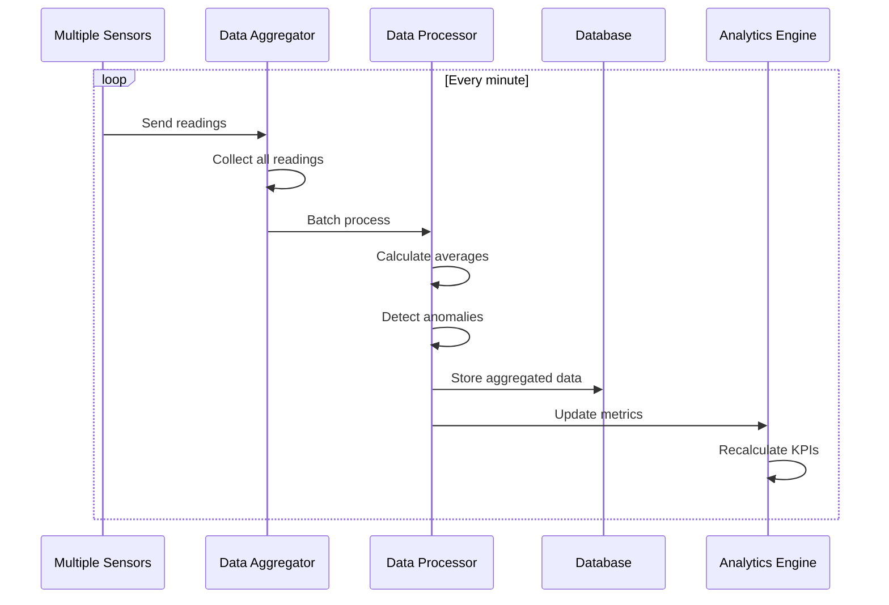
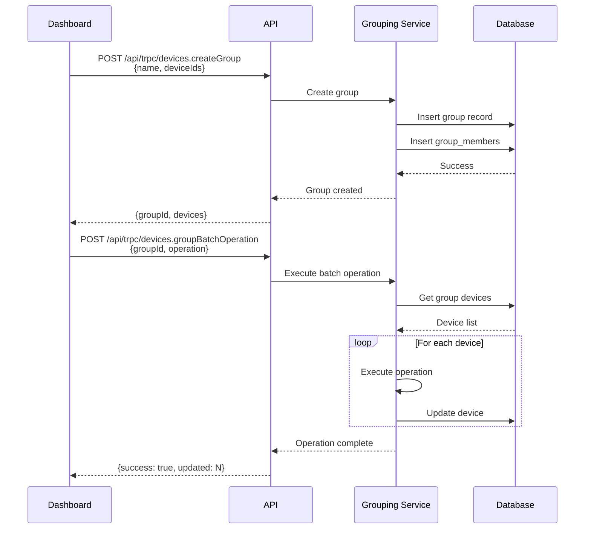

# Smart Factory IoT - API Flows & Sequences

## Authentication Flow



## Real-time Device Monitoring Flow



## Alert Management Flow



## Device Management Flow



## OTA Update Flow



## Analytics & Reporting Flow



## Error Handling Flow



## WebSocket Connection Management



## Data Aggregation Flow



## Multi-Device Grouping Flow



## API Response Format

### Success Response
```json
{
  "result": {
    "data": {
      "id": 1,
      "name": "Device 1",
      "status": "online"
    }
  }
}
```

### Error Response
```json
{
  "error": {
    "code": "UNAUTHORIZED",
    "message": "Invalid credentials",
    "data": {
      "code": "UNAUTHORIZED"
    }
  }
}
```

## Rate Limiting

- **API Endpoints**: 100 requests per minute per user
- **WebSocket**: 1000 messages per minute per connection
- **File Upload**: 10 MB per file, 100 MB per day

## Timeout Configuration

| Operation | Timeout |
|-----------|---------|
| REST API Call | 30 seconds |
| WebSocket Connection | 60 seconds |
| Database Query | 10 seconds |
| File Upload | 5 minutes |
| Device Firmware Download | 30 minutes |

## API Versioning

- Current Version: v1
- Endpoint Pattern: `/api/trpc/[router].[procedure]`
- Backward Compatibility: Maintained for 2 major versions
- Deprecation Notice: 6 months before removal
