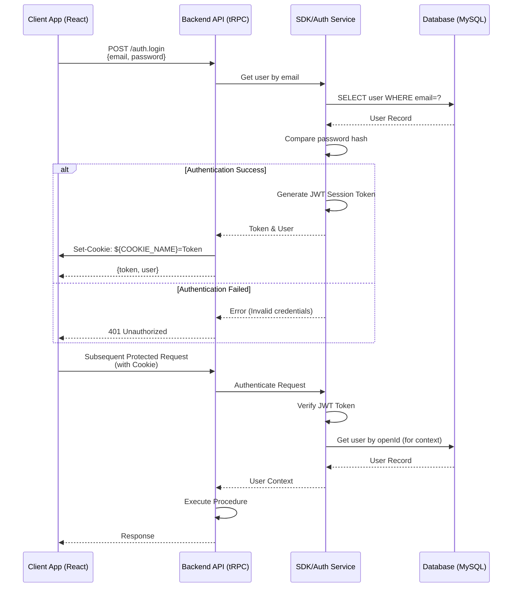
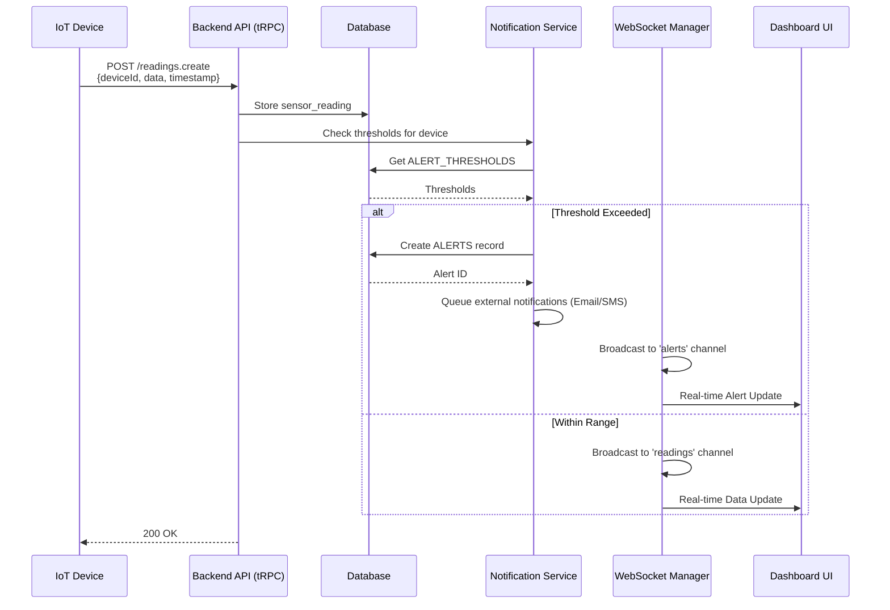
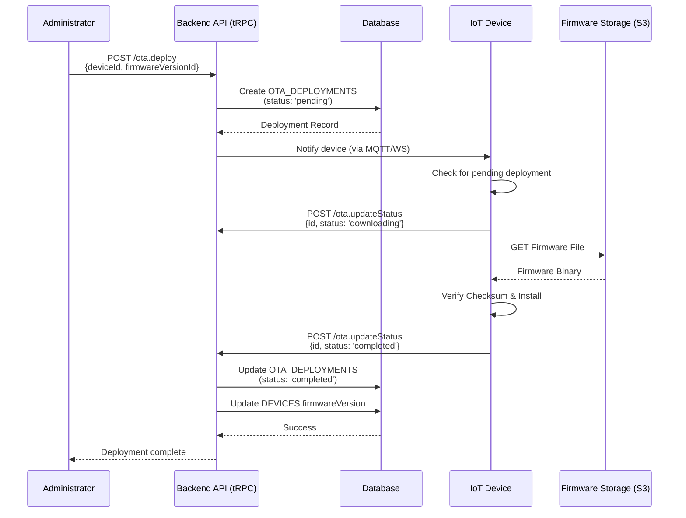
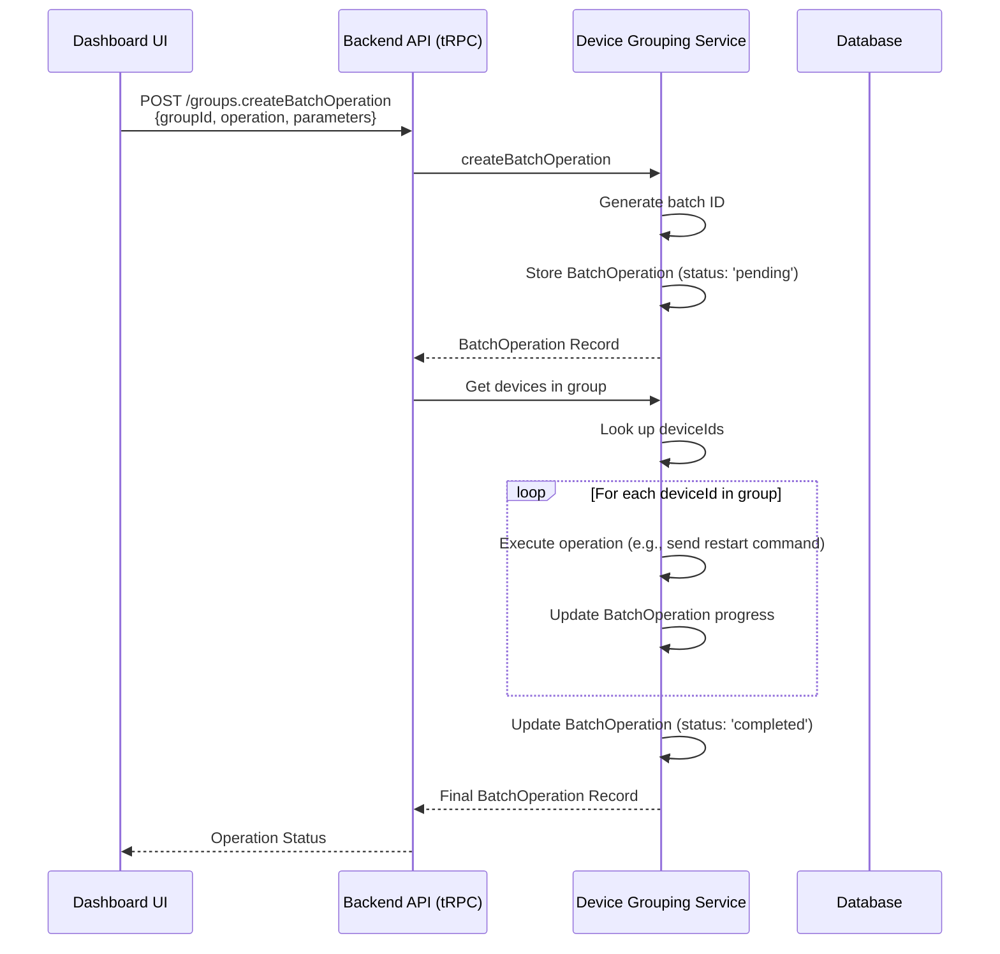
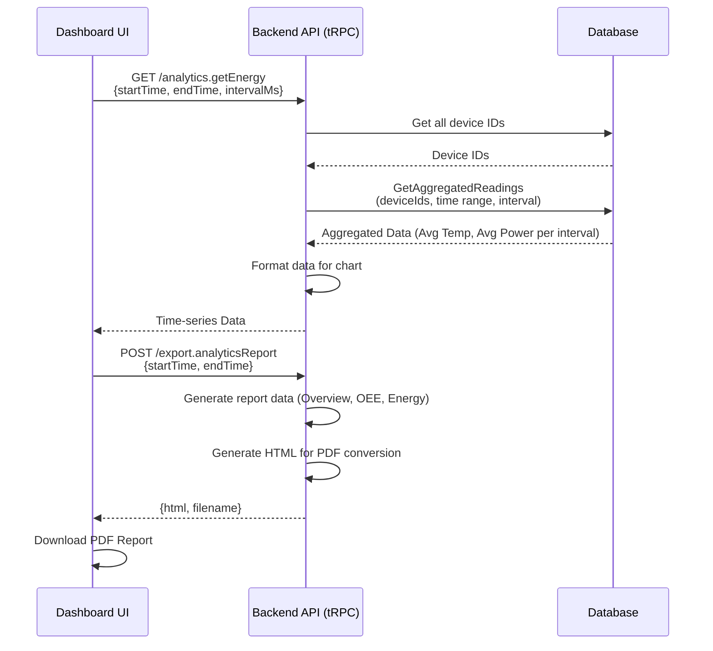

# Smart Factory IoT - API Flows & Sequences

This document outlines the primary API flows and sequence diagrams for the Smart Factory IoT platform. The backend is built using **Node.js with Express and tRPC**, ensuring type-safe API contracts between the server and the React frontend.

## 1. Authentication and Authorization Flow

The system uses a combination of password-based login and a session-based JWT token stored in a secure cookie.



## 2. Real-time Sensor Data Ingestion and Alerting Flow

IoT devices send sensor readings to the server, which processes them in real-time to check for threshold violations and broadcast updates via WebSocket.



## 3. Over-The-Air (OTA) Firmware Deployment Flow

The administrator initiates a firmware update, which is tracked through a deployment record and reported by the device.



## 4. Device Grouping and Batch Operation Flow

The `DeviceGroupingService` manages logical groups (zones, production lines) and enables batch operations across all devices in a group.



## 5. Analytics and Reporting Flow

The analytics API aggregates historical sensor data to calculate KPIs like energy consumption and OEE (Overall Equipment Effectiveness).



## 6. API Response Structure (tRPC)

The tRPC framework provides a standardized, type-safe response structure.

### Success Response

```json
{
  "result": {
    "data": {
      "id": 1,
      "name": "Device 1",
      "status": "online"
    }
  }
}
```

### Error Response

All errors are standardized using `TRPCError` with a clear code and message.

```json
{
  "error": {
    "code": "UNAUTHORIZED",
    "message": "Invalid or missing authentication",
    "data": {
      "code": "FORBIDDEN",
      "httpStatus": 403
    }
  }
}
```

## 7. Security and Performance Considerations

| Feature | Description | Configuration |
| :--- | :--- | :--- |
| **Rate Limiting** | Protects against brute-force and denial-of-service attacks. | 100 requests/minute per IP for REST endpoints. |
| **Input Validation** | Ensures all incoming data conforms to expected schemas. | Implemented via **Zod** for all tRPC procedures. |
| **Authentication** | Uses secure, signed JWTs stored in HTTP-only cookies. | JWT expiration set to 1 year. |
| **Data Encryption** | Sensitive data (passwords) are hashed with **bcrypt**. | HTTPS/TLS enforced for all traffic. |
| **Timeouts** | Prevents long-running requests from consuming resources. | API Gateway timeout: 30 seconds. |
| **Caching** | Reduces database load for static or frequently accessed data. | Redis cache for thresholds and device metadata. |
