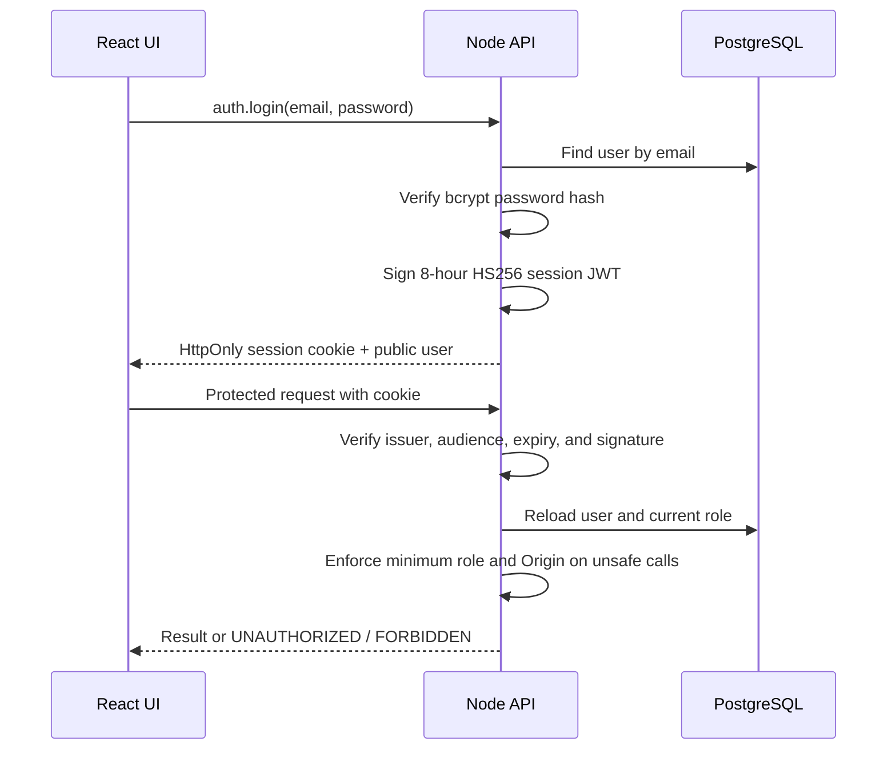
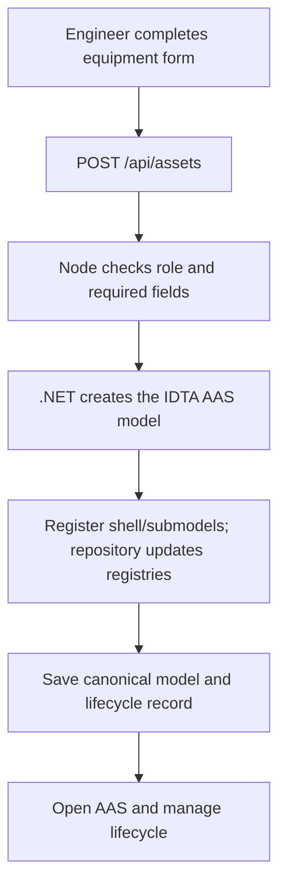
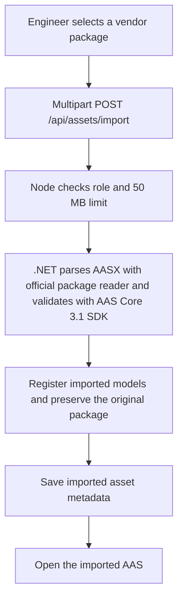
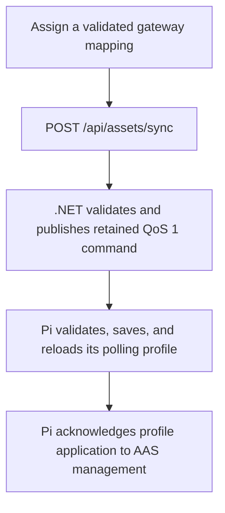
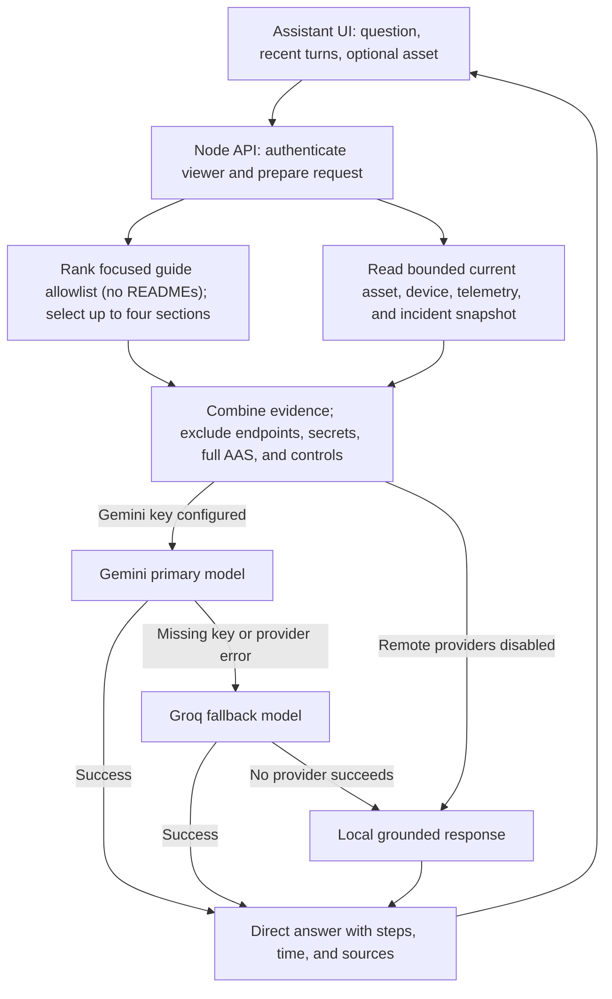
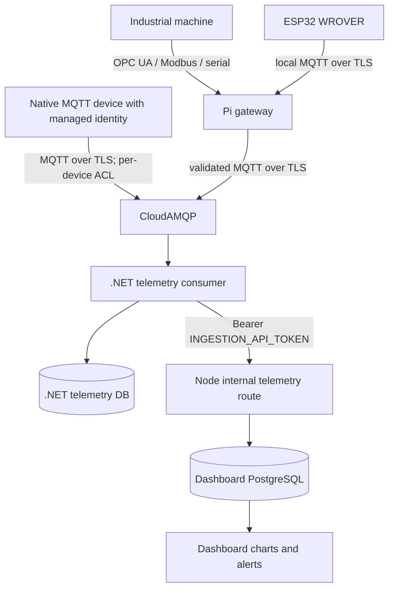
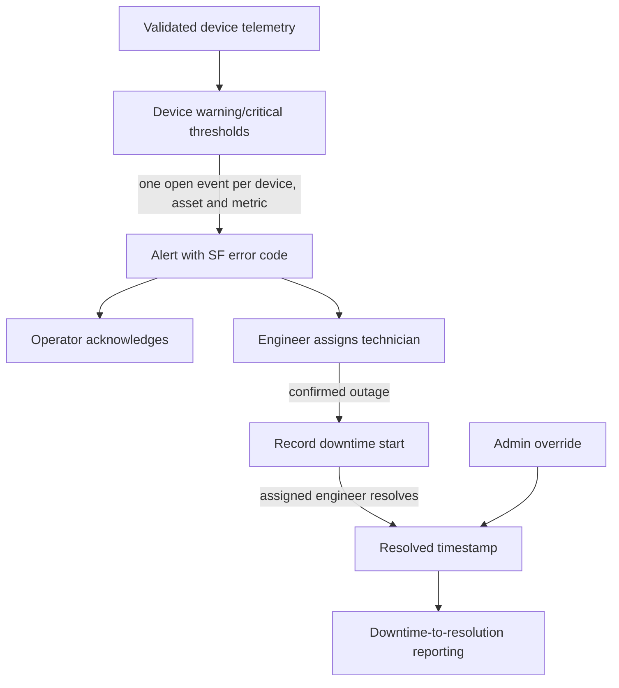

# API Flows

The React client calls the Node/Express tRPC API. Server-side procedures enforce the user's current database role; client-side route and button checks only control presentation.

## Login and authorization

```mermaid
sequenceDiagram
  participant UI as React UI
  participant API as Node API
  participant DB as PostgreSQL
  UI->>API: auth.login(email, password)
  API->>DB: Find user by email
  API->>API: Verify bcrypt password hash
  API->>API: Sign 8-hour HS256 session JWT
  API-->>UI: HttpOnly session cookie + public user
  UI->>API: Protected request with cookie
  API->>API: Verify issuer, audience, expiry, and signature
  API->>DB: Reload user and current role
  API->>API: Enforce minimum role and Origin on unsafe calls
  API-->>UI: Result or UNAUTHORIZED / FORBIDDEN
```

Registration creates viewer accounts. The browser neither reads nor stores the JWT. When `ENABLE_DEMO_ACCOUNTS=true`, `auth.demoAccounts` returns the four demo shortcuts to the login page and the server seeds those identities. Enabling this in production exposes fixed credentials, including administrator access, and is supported only for an isolated demonstration tenant without sensitive data or connected equipment.

## Register and delete connectivity devices

Engineers and administrators can call `devices.create` with `type: "gateway" | "edge_device"`, a stable device ID, name, and optional location/zone. Older callers that omit `type` default to `gateway`. Only administrators can call `devices.delete`. A gateway linked to an AAS must be disconnected first; telemetry history is retained.

## Register an asset and open its AAS

### Quick Create (Form)

```mermaid
flowchart TD
  Engineer[Engineer completes equipment form] --> API[POST /api/assets]
  API --> Node[Node checks role and required fields]
  Node --> DotNet[.NET creates the IDTA AAS model]
  DotNet --> AAS[Register shell/submodels; repository updates registries]
  AAS --> Store[Save canonical model and lifecycle record]
  Store --> Review[Open AAS and manage lifecycle]
```

### Import Package (.aasx)

```mermaid
flowchart TD
  Engineer[Engineer selects a vendor package] --> API[Multipart POST /api/assets/import]
  API --> Node[Node checks role and 50 MB limit]
  Node --> DotNet[.NET parses AASX with official package reader and validates with AAS Core 3.1 SDK]
  DotNet --> Register[Register imported models and preserve the original package]
  Register --> Store[Save imported asset metadata]
  Store --> Review[Open the imported AAS]
```

Form-managed AAS edits submit the revision currently loaded by the engineer. PostgreSQL serializes changes per asset, the .NET service confirms the matching repository revisions before replacing them, and the API appends a snapshot plus SHA-256 digest. A stale update returns HTTP 409. Restoring a snapshot creates a new revision. Reusing an imported shell identifier is rejected by the unique asset key and does not replace the existing package.

### Deploy and confirm an edge profile

```mermaid
flowchart TD
  Asset[Assign a validated gateway mapping] --> API[POST /api/assets/sync]
  API --> DotNet[.NET validates and publishes retained QoS 1 command]
  DotNet --> Pi[Pi validates, saves, and reloads its polling profile]
  Pi --> Ack[Pi acknowledges profile application to AAS management]
```

The UI's `assets.*` tRPC procedures expose dashboard workflows. `/api/assets/import` is a role-checked multipart API with a 50 MB package limit. `/api/aas/*` is the standards API gateway: the Node service checks the application session and engineer/admin role, resolves an OAuth token endpoint from OIDC discovery or uses its configured direct URL, and forwards the request with a service bearer token. Writes to dashboard-managed records are blocked at this gateway so edits cannot skip revision history. Do not expose AAS services directly to browsers.

After a repository mutation, DeviceService publishes an `aas_changed` event to Redis Pub/Sub. Each dashboard replica fans the event out to its own authenticated WebSocket clients, so a browser connected to any replica can refresh its AAS view. Engineers and admins can export the current asset hierarchy as CAEX 3.0 from **Assets → Export AutomationML**; the export carries stable asset IDs and basic metadata but not gateway mappings.

Only administrators can call `assets.delete`. It removes the selected dashboard AAS and its represented BaSyx resources, retains historical telemetry and incidents, and reports gateway resynchronization failures.

### Assistant context and provider routing

```mermaid
flowchart TD
  UI["Assistant UI: question, recent turns, optional asset"] --> API["Node API: authenticate viewer and prepare request"]
  API --> DOCS["Rank focused guide allowlist (no READMEs); select up to four sections"]
  API --> DB["Read bounded current asset, device, telemetry, and incident snapshot"]
  DOCS --> EVIDENCE["Combine evidence; exclude endpoints, secrets, full AAS, and controls"]
  DB --> EVIDENCE
  EVIDENCE -->|Gemini key configured| GEMINI["Gemini primary model"]
  EVIDENCE -->|Remote providers disabled| LOCAL["Local grounded response"]
  GEMINI -->|Success| ANSWER["Direct answer with steps, time, and sources"]
  GEMINI -->|Missing key or provider error| GROQ["Groq fallback model"]
  GROQ -->|Success| ANSWER
  GROQ -->|No provider succeeds| LOCAL
  LOCAL --> ANSWER
  ANSWER --> UI
```

The `assistant.ask` procedure is available to signed-in viewers and higher. It ranks only the explicit focused-guide allowlist in `server/assistantKnowledge.ts` (README files are excluded), adds a bounded snapshot from the dashboard database, and sends recent conversation context plus relevant evidence to Gemini first and Groq second when server API keys are configured. Keys remain on the server. Answers are formatted for readability and include ordered steps for how-to questions; the UI shows context capture time and source excerpts without provider/model labels or a provider data-transmission notice. With providers disabled or unavailable, a local grounded response remains available. The Assistant does not read environment files, README files, full AAS packages, private account records, or machine-control interfaces. See [Assistant configuration and data boundaries](assistant.md).

Asset Analytics sends selected AAS identifiers and a selected time range to `analytics.getAssetTelemetry`; readings are selected by their persisted asset attribution and can be scoped to one asset or filtered into metadata groups. The response includes per-asset means and peaks for power, temperature, vibration, pressure, and speed; linked-device alert counts; alert events in the period; and early-to-recent temperature, vibration, and pressure changes where the observed sample span supports comparison. These changes are descriptive screening indicators: they are not degradation models, failure predictions, or remaining-useful-life estimates. Pressure and vibration retain device-profile scales, so the UI avoids aggregating their charts across multiple assets. The service does not calculate OEE, capacity utilization, kWh, energy per unit, emissions, causal root cause, TCO, or MTBF until its required production, calibrated energy, maintenance, failure, and cost inputs are recorded.

The **Dashboard** summarizes API-backed asset, gateway, lifecycle, active-alert, and confirmed downtime state, including the longest current outage and average downtime-to-resolution. **Live Monitoring** shows gateway and edge-device connectivity with batched latest readings. **Alerts** combines the response queue and searchable/exportable records, while threshold configuration remains attached to gateway details.

Gateway publication updates a complete desired-state profile over MQTT. QoS 1 broker publication is not an edge-application receipt; the Pi publishes an acknowledgement under the matching command topic. The operator may also download the profile for controlled offline deployment. Credentials are configured on the edge host and are not included in either path.

## Edge configuration, control, and firmware

These are separate operations. **Edge configuration** sends the gateway a desired-state profile containing asset identity, protocol mappings, and telemetry rules; only the gateway's matching application acknowledgement indicates that it applied the profile. **Control** sends a bounded, device-specific command through an authorized protocol adapter. **Firmware update** replaces executable code and requires a compatible updater, trusted release artifact, integrity/signature verification, device-reported result, and recovery strategy. A configuration acknowledgement does not verify firmware or machine motion.

| Target | Configuration / control path | Firmware update path in this release |
|---|---|---|
| Raspberry Pi gateway | MQTT desired-state profile with gateway acknowledgement; supported adapters are documented in the edge repository. | Manual staged deployment over SSH/rsync; no remote updater or dashboard OTA. |
| ESP-WROVER-KIT | Telemetry and bounded GPIO18 pulse requests route through the Pi; operators and higher can use the dashboard's commissioned indicator control. A GPIO acknowledgement confirms a logic output only. | Build with PlatformIO and flash over USB; firmware has no OTA receiver. |
| ADA031 V4 arm | USB serial through the Pi gateway; the AAS page exposes bounded joint jogs for authorized roles. No position feedback or independent safety function is claimed. | Program the Uno over USB using the vendor sketch; no OTA. |
| Other industrial assets | Requires an asset-specific protocol adapter, authorization policy, interlocks, limits, and verified feedback appropriate to that machine. | Requires a vendor-supported update mechanism and tested release/recovery process; there is no universal industrial OTA protocol. |

The firmware inventory page is read-only. Backend OTA submission/status endpoints return `501 Not Implemented` and do not mutate rollout state until a verified release service and authenticated device agent exist. Legacy rollout rows are historical application records, not proof of installation. Do not use software commands as emergency-stop, guarding, or other protective functions.

## Edge telemetry

Connected ADA031 firmware emits controller state, cycle count, commanded targets, and movement-active signals while a program runs. The Pi publishes these as `assetSignals`, and the AAS view renders their latest values. After USB re-enumeration the gateway discards the failed serial descriptor and reopens the stable `/dev/serial/by-id/...` path on the next poll. This is controller telemetry, not measured physical joint feedback.

```mermaid
  flowchart TD
  Machine[Industrial machine] -->|OPC UA / Modbus / serial| Pi[Pi gateway]
  ESP[ESP32 WROVER] -->|local MQTT over TLS| Pi
  Direct[Native MQTT device with managed identity] -->|MQTT over TLS; per-device ACL| MQTT[CloudAMQP]
  Pi -->|validated MQTT over TLS| MQTT[CloudAMQP]
  MQTT --> DotNet[.NET telemetry consumer]
  DotNet --> BackendDB[(.NET telemetry DB)]
  DotNet -->|Bearer INGESTION_API_TOKEN| Bridge[Node internal telemetry route]
  Bridge --> AppDB[(Dashboard PostgreSQL)]
  AppDB --> Dashboard[Dashboard charts and alerts]
```

WROVER and ADA031 remain behind the Pi gateway. The WROVER is allowlisted by the Pi and can publish only to the Pi-local Mosquitto listener; its firmware has no CloudAMQP credentials or internet route. Other eligible devices with native MQTT/TLS and per-device identities may connect directly to CloudAMQP. The gateway validates its local topic, identity, payload size, timestamp, and metric fields before forwarding. Normalized timestamps are Unix epoch milliseconds in UTC. The authenticated telemetry bridge stores the optional gateway identifier with the device record; connectivity views render child records as `GatewayID-DeviceID` and show a gateway by its own ID. The bridge validates the payload and compares a service-only token in constant time. This credential is independent of user sessions and must only be installed in backend service configuration.

## Alert generation and resolution

```mermaid
flowchart TD
  Telemetry[Validated device telemetry] --> Thresholds[Device warning/critical thresholds]
  Thresholds -->|one open event per device, asset and metric| Alert[Alert with SF error code]
  Alert --> Operator[Operator acknowledges]
  Alert --> Engineer[Engineer assigns technician]
  Engineer -->|confirmed outage| Down[Record downtime start]
  Down -->|assigned engineer resolves| Resolved[Resolved timestamp]
  Resolved --> MTTR[Downtime-to-resolution reporting]
  Admin[Admin override] --> Resolved
```

Alert codes are platform classifications unless a source-specific code is provided. A threshold event does not automatically imply machine downtime; the assigned engineer-role incident responder records that point when the machine is confirmed unavailable. Device-offline alerts report lost communication; they do not automatically start factory downtime. Historical inferred downtime records require review. Only alerts with a downtime start and a resolution time contribute to the mean downtime-to-resolution metric. Operators can acknowledge, while assigned engineer-role responders or admins can resolve.

See [authorization and AAS](authorization-and-aas.md) for the role matrix, template versions, configuration variables, and verification commands.

## Identity, coverage and incident notifications

In Render mode, `auth.me` delegates to the private IdentityService with the authenticated dashboard account ID and a separate service token; the service reads the current role from PostgreSQL. It never returns an email-provider or AAS access token. `analytics.getCoverage` delegates a bounded selected-asset/time range to AnalyticsService, which aggregates indexed stored samples without treating missing metrics as zero.

Alert writes atomically create the per-user inbox via the database trigger. Account creation queues a password-free welcome message without rolling back the new account if queueing is temporarily unavailable. `notifications.list` and `notifications.markRead` are authenticated owner-only operations. `notifications.retryEmail` requires an engineer/admin owner and an eligible failed/unconfigured/unauthorized incident job. Reading a notification is independent of incident acknowledgment. The UI links incident notifications to event details by ID. NotificationService delivers the durable queue through the configured Amazon SES or Resend sender and checks current account role and recipient policy at delivery time.
