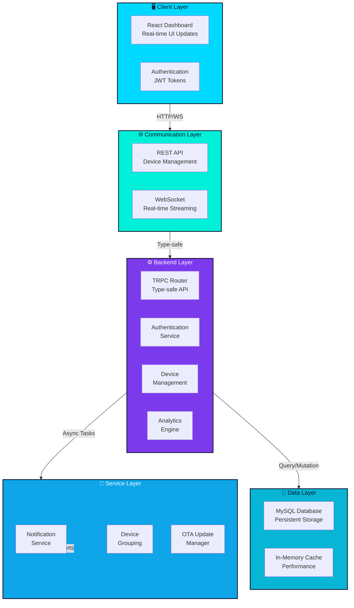

# Smart Factory IoT - System Architecture

## Overview

The Smart Factory IoT platform is a comprehensive real-time industrial monitoring and control system built with modern web technologies. It provides real-time device monitoring, alert management, and analytics for manufacturing environments.

## System Architecture Diagram



## Component Details

### Client Layer
- **React Dashboard**: Interactive UI for real-time monitoring
- **Authentication**: JWT-based secure authentication
- **State Management**: React Context + TRPC Query Client

### Communication Layer
- **REST API**: Device CRUD operations, configuration
- **WebSocket**: Real-time sensor data streaming
- **TRPC**: Type-safe RPC framework for frontend-backend communication

### Backend Layer
- **TRPC Router**: Centralized API endpoint management
- **Authentication Service**: JWT token validation and user management
- **Device Management**: CRUD operations and device grouping
- **Analytics Engine**: OEE calculations and reporting

### Data Layer
- **MySQL Database**: Persistent storage for all entities
- **In-Memory Cache**: Performance optimization for frequently accessed data

### Service Layer
- **Notification Service**: Email/SMS alerts for critical events
- **Device Grouping**: Batch operations and analytics aggregation
- **OTA Update Manager**: Firmware update distribution and tracking

## Data Flow

### Real-time Monitoring Flow
```
Device → WebSocket → Backend → Database
                  ↓
              Dashboard ← Real-time Updates
```

### Alert Flow
```
Sensor Reading → Threshold Check → Alert Generated
                                 ↓
                        Notification Service
                                 ↓
                        User Notification
```

### Device Management Flow
```
User Action → REST API → Backend Service
                          ↓
                      Database Update
                          ↓
                      Response to Client
```

## Technology Stack

| Layer | Technology | Purpose |
|-------|-----------|---------|
| Frontend | React 19 | UI Framework |
| Frontend | TypeScript | Type Safety |
| Frontend | Tailwind CSS | Styling |
| Frontend | TRPC Client | Type-safe API |
| Backend | Node.js | Runtime |
| Backend | Express.js | Web Framework |
| Backend | TRPC | RPC Framework |
| Database | MySQL | Data Storage |
| Real-time | WebSocket | Live Updates |
| Auth | JWT | Token-based Auth |

## Key Features

### 1. Real-time Monitoring
- Live device status updates via WebSocket
- Sensor data streaming with minimal latency
- Automatic reconnection handling

### 2. Alert Management
- Threshold-based alerts
- Multiple severity levels (critical, warning, info)
- Alert acknowledgment and resolution tracking

### 3. Device Management
- CRUD operations for devices
- Device grouping and batch operations
- Device health monitoring

### 4. Analytics
- OEE (Overall Equipment Effectiveness) calculation
- Historical data analysis
- Trend reporting

### 5. Firmware Management
- OTA (Over-The-Air) update distribution
- Update status tracking
- Rollback capability

## Security Architecture

### Authentication
- JWT-based token authentication
- Secure password hashing with bcryptjs
- Token refresh mechanism

### Authorization
- Role-based access control (RBAC)
- User, Operator, Admin roles
- Resource-level permissions

### Data Protection
- HTTPS/TLS encryption in transit
- Database encryption at rest
- Input validation and sanitization

## Scalability Considerations

### Horizontal Scaling
- Stateless backend design
- Database connection pooling
- Load balancing ready

### Performance Optimization
- Query optimization with indexes
- Caching layer for frequently accessed data
- Batch operations for bulk updates

### Monitoring & Observability
- Comprehensive logging
- Error tracking
- Performance metrics

## Deployment Architecture

```
┌─────────────────────────────────────┐
│     Production Environment          │
├─────────────────────────────────────┤
│  Load Balancer (Optional)           │
│         ↓                           │
│  ┌─────────────────────────────┐   │
│  │  Application Server         │   │
│  │  (Node.js + Express)        │   │
│  │  - TRPC API                 │   │
│  │  - WebSocket Handler        │   │
│  │  - Static Files             │   │
│  └─────────────────────────────┘   │
│         ↓                           │
│  ┌─────────────────────────────┐   │
│  │  Database Server            │   │
│  │  (MySQL)                    │   │
│  │  - Persistent Data          │   │
│  │  - Backup & Recovery        │   │
│  └─────────────────────────────┘   │
│         ↓                           │
│  ┌─────────────────────────────┐   │
│  │  External Services          │   │
│  │  - Email Service            │   │
│  │  - SMS Gateway              │   │
│  └─────────────────────────────┘   │
└─────────────────────────────────────┘
```

## Development Workflow

1. **Local Development**
   - Start dev server: `pnpm dev`
   - Hot module reloading enabled
   - Mock data seeding available

2. **Testing**
   - Unit tests: `pnpm test`
   - Type checking: `pnpm check`
   - Build verification: `pnpm build`

3. **Deployment**
   - Build production bundle: `pnpm build`
   - Run deployment script: `./deploy.sh`
   - Database migrations: `pnpm db:push`

## SOLID Principles Implementation

### Single Responsibility
- Each component has one clear purpose
- Services are focused and specialized
- Separation of concerns throughout

### Open/Closed
- Components extensible through props
- Services extensible through interfaces
- Plugin architecture for notifications

### Liskov Substitution
- Consistent interfaces across services
- Predictable behavior across implementations
- Type-safe substitution

### Interface Segregation
- Minimal required props per component
- Focused service interfaces
- Specific API endpoints

### Dependency Inversion
- Services depend on abstractions
- Dependency injection pattern
- No hard dependencies on implementations

## Performance Metrics

- **API Response Time**: < 200ms (p95)
- **WebSocket Latency**: < 100ms
- **Dashboard Load Time**: < 2s
- **Database Query Time**: < 50ms (p95)
- **Memory Usage**: < 512MB
- **CPU Usage**: < 50% under normal load

## Future Enhancements

1. **Machine Learning**
   - Predictive maintenance
   - Anomaly detection
   - Pattern recognition

2. **Advanced Analytics**
   - Real-time dashboards
   - Custom reporting
   - Data export capabilities

3. **Integration**
   - Third-party API integrations
   - MQTT support
   - Cloud connectivity

4. **Scalability**
   - Microservices architecture
   - Kubernetes deployment
   - Multi-region support
