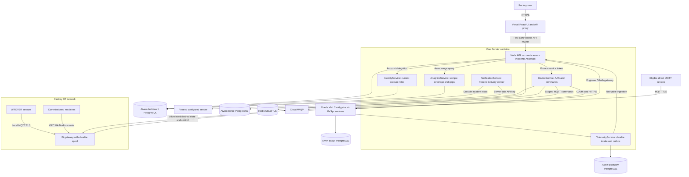

# Smart Factory IoT Architecture

## Repository responsibilities

| Repository | Responsibility |
|---|---|
| `smart-factory-iot` | React dashboard, Node/Express tRPC API, PostgreSQL schema, accounts, roles, asset workflows, lifecycle history, demo data, and standards API gateway |
| `smart-factory-iot-backend` | .NET services for identity, telemetry ingestion, MQTT consumption, analytics, notifications, device APIs, and AAS generation/provisioning |
| `smart-factory-iot-edge` | Raspberry Pi machine gateway and ESP32 WROVER sensor firmware |

The Node API is the dashboard account and role authority. Dashboard sessions are HttpOnly cookies. The .NET telemetry bridge and the .NET AAS provisioner use separate service credentials. The private AAS stack has separate AAS and Submodel Repositories, AAS and Submodel Registries, a Concept Description Repository, and an AASX File Server.

Production hosts the React UI on Vercel and all six backend processes in one supervised Render container. Only the Node API is public; the five .NET services bind to loopback. Aiven, Redis Cloud and CloudAMQP remain managed external systems. The AAS runtime is a separate Oracle Cloud VM running six BaSyx services behind Caddy and a client-credentials token endpoint; it stores AAS data in the dedicated Aiven `basyx` database. Physical Pi gateways, WROVER sensors and ADA031 controllers remain in the factory.

## Request and data flow

```mermaid
flowchart TB
  Browser[Factory user] -->|HTTPS| Vercel[Vercel React UI and API proxy]
  subgraph Render[One Render container]
    API[Node API: accounts assets incidents Assistant]
    Device[DeviceService: AAS and commands]
    Telemetry[TelemetryService: durable intake and outbox]
    Identity[IdentityService: current account roles]
    Analytics[AnalyticsService: sample coverage and gaps]
    Notification[NotificationService: Resend delivery worker]
    API -->|Private service token| Device
    API -->|Account delegation| Identity
    API -->|Asset range query| Analytics
    Telemetry -->|Retryable ingestion| API
  end
  Vercel -->|First-party cookie API rewrite| API
  API --> AppDB[(Aiven dashboard PostgreSQL)]
  Identity --> AppDB
  Analytics --> AppDB
  Notification -->|Durable incident inbox| AppDB
  Notification -->|Server-side API key| Resend[Resend configured sender]
  Device --> DeviceDB[(Aiven device PostgreSQL)]
  Telemetry --> TelemetryDB[(Aiven telemetry PostgreSQL)]
  API --> Redis[(Redis Cloud TLS)]
  Device --> Redis
  Device -->|OAuth and HTTPS| AAS[Oracle VM: Caddy plus six BaSyx services]
  API -->|Engineer OAuth gateway| AAS
  AAS --> BaSyxDB[(Aiven basyx PostgreSQL)]
  subgraph OT[Factory OT network]
    Sensors[WROVER sensors] -->|Local MQTT TLS| Pi[Pi gateway with durable spool]
    Machines[Commissioned machines] -->|OPC UA Modbus serial| Pi
  end
  Pi -->|MQTT TLS| Broker[CloudAMQP]
  Direct[Eligible direct MQTT devices] -->|MQTT TLS| Broker
  Broker --> Telemetry
  Device -->|Scoped MQTT commands| Broker
  Broker -->|Allowlisted desired state and control| Pi
```

## Production deployment topology

Supervisor starts and restarts all six services as the image's non-root user. Node listens on Render's dynamic public `PORT`; Device, Telemetry health, Identity, Analytics and Notification use private ports 3102–3106. Node readiness requires database/Redis and every backend process; liveness remains available during dependency failures.

The deployment is one instance. An attached Render disk forces sequential restarts to protect the stable persistent MQTT session from overlapping workers. Application state lives in PostgreSQL/Redis and edge spools; the disk is a rollout safeguard. Releases cause a brief API interruption covered by bounded edge/broker queues. Horizontal scaling and high availability require a separate tested consumer ownership design.

A protected dashboard `main` push starts the sole production release workflow. It resolves immutable revisions for all three repositories, tests one `linux/amd64` image containing the Node API and five .NET services, publishes that exact digest, deploys it to Render, waits for readiness, and then deploys the separately prebuilt static React artifact to Vercel. The frontend is not a Docker runtime. Independent provider Git/auto-deploy paths remain disabled to prevent an untested or out-of-order release. See [Vercel/Render deployment](../RENDER_DEPLOYMENT.md) for provider configuration, migrations, source-pinned CI/CD and rollback.

## Assets and AAS

The Devices page registers connectivity records as either `gateway` or `edge_device`. Both are devices; industrial equipment represented by an AAS belongs under Assets and can be mapped to a gateway.

An industrial asset is distinct from an edge gateway. Quick Create sends validated equipment identity to the private DeviceService, which generates IDTA template instances, registers them with the AAS and Submodel Repositories, and returns the canonical documents for application persistence. BaSyx can register descriptors automatically with the AAS and Submodel Registries. Import Package uploads a bounded multipart `.aasx`; DeviceService validates OPC relationships and supported AAS core JSON/XML, registers each shell, submodel, and concept description, and stores the original package in the AASX File Server. The generated AAS Core 3.1 C# SDK validates models through a compatibility view for v3.2 administrative timestamps; this is not full v3.2 metamodel conformance. Node associates returned shell documents with asset rows in the same PostgreSQL database. Imported shells preserve their vendor package and cannot be overwritten through the form editor. `asset_devices` maps an asset to a gateway, protocol, endpoint, and tag/register mappings. Credentials are not stored in endpoint URLs or published mappings. Lifecycle history remains an application audit log.

The full standards API is not reimplemented in tRPC. `/api/aas/*` authenticates the application session, requires the engineer or admin role, and proxies methods to the configured AAS component using an OAuth client-credentials token. Repository, submodel, registry, and file-service URLs are configured independently. The dashboard gateway and DeviceService can resolve the token endpoint from OIDC discovery or use an explicit token URL; an optional scope is sent with the token request. This allows company endpoints to be changed through deployment configuration. Public IDTA demonstrators remain test targets and are not production data stores. If no AAS service is configured, the gateway returns `503`; dashboard asset records and JSON export remain available from PostgreSQL. DeviceService publishes retained QoS 1 complete desired-state profiles and short-lived non-retained ADA031 V4 jog commands to CloudAMQP gateway command topics. The dashboard signs a short-lived engineer/admin token after checking the current database role, and DeviceService enforces that role on its control route. The Pi applies profiles atomically and only accepts an ADA031 command for an exact local allowlisted asset ID and matching `ada031_v4_serial` profile. Its one-byte USB serial write acknowledgement is not physical-motion feedback. The WROVER cannot access CloudAMQP; only its Pi gateway consumes that gateway's command topic. CloudAMQP requires TLS and scoped service/gateway credentials. The Pi-local Mosquitto broker uses TLS and per-sensor publish-only ACLs; the WROVER has no cloud credentials. Its optional Pi-local command subscription accepts only commissioned bounded GPIO pulses. Eligible native MQTT devices can connect directly to CloudAMQP with individual TLS identities and per-device ACLs; the backend receives both direct and gateway-originated telemetry. CAEX 3.0 export is available for the asset hierarchy, but it omits machine address mappings and is not validated against AutomationML OWL/SHACL recommendations.

This is an asset lifecycle, telemetry, and gateway configuration platform, not a safety-rated control system. It must not perform emergency-stop, guarding, interlock, or other protective functions. Keep those functions independent and complete a site-specific risk assessment and validation before production use.

When no assets exist, `ENABLE_DEMO_DATA=true` seeds example assets through the API/database layer. Browser code does not contain fallback equipment records. Local development may build local AAS JSON when the provisioner URL is absent; production asset creation fails closed until the private .NET provisioner is configured.

## Identity and access

The Node API verifies bcrypt password hashes, issues an eight-hour HS256 JWT in an HttpOnly cookie, and reloads the current user role from PostgreSQL for protected requests. Cookie-authenticated unsafe requests with an `Origin` header must match the same origin or an exact allowed frontend origin. Browser code does not read or store the JWT. `viewer`, `operator`, `engineer`, and `admin` are the application roles. The AAS client-credentials identity is server-only and must be trusted by the AAS runtime's OIDC/ABAC configuration.

## Demo data

With the demo-data flag enabled, startup seeds a PostgreSQL-backed compressor, transformer, and Windformer wind turbine generator scenario when no live assets exist. The seed includes gateway connections, telemetry, alerts, template-based AAS documents, and lifecycle history. Windformer identity and operating measurements are synthetic, and the seeded 2.5 MW nameplate is a demo value. An idempotent upgrade adds Windformer to an existing demo scenario without replacing its records. Demo records are visibly simulated and cannot be lifecycle-edited. Demo login seeding is separately enabled and hard-disabled in production.

The supplied `aas-specs-aasx-3.2.0.zip` includes the IDTA-01005 package example, which demonstrates generic shells, submodels, and embedded files. It does not define a Windformer machine model. The import UI renders the imported shell, nested elements, semantic identifiers, concept descriptions, and file references from the package; Windformer is generated separately from the application's IDTA template builder and its synthetic telemetry is marked as demo data.

The ADA031 V4 controller has bounded jog, calibrated repeat, demonstration, operational stop, and neutral commands—not arbitrary motion setpoints. Each engineer/admin action publishes an expiring command; the Pi checks the local asset allowlist and protocol profile, then writes one allowlisted ASCII byte at 9600 baud. The connected firmware supplies software clamps and controller telemetry, but the application cannot confirm actual position, mechanical travel, or completed movement. The first USB serial open can reset the board and move its five controlled servos to 90°. General industrial motion, speed/angle setpoints, and software emergency stops are not implemented. Gateway and direct-MQTT telemetry paths are both supported; use a gateway for local protocols/control and use direct MQTT only for native-network devices with device-scoped TLS credentials and ACLs. An application command is not a safety-rated emergency stop; emergency-stop and safe-torque functions require a machine-specific safety design and independent safety hardware. See [EU Machinery Regulation 2023/1230](https://eur-lex.europa.eu/eli/reg/2023/1230/oj) and [IEC 60204-1](https://webstore.iec.ch/en/publication/71256).

## Storage and operations

- The dashboard API uses PostgreSQL through Drizzle ORM. Production uses Aiven with `DATABASE_SSL_MODE=verify-full` and the provider CA in `DATABASE_CA_CERT`; local Compose uses local PostgreSQL with TLS disabled.
- Production Redis Cloud URLs must use `rediss://`; Redis Pub/Sub is transient notification transport, not durable application data.
- Keep CloudAMQP MQTT (port 8883/TLS) and AMQPS credentials on backend services and the Pi gateway only. The WROVER receives distinct local Mosquitto credentials and the Pi broker CA.
- Store `JWT_SECRET`, `INGESTION_API_TOKEN`, AAS OAuth client secret, database credentials, broker credentials, and machine protocol credentials in a secret manager or protected runtime variables.
- Keep the AAS Environment and its database on a private network. Expose `/api/aas/*` only through the Node role-checking gateway.
- The E2E script uses a disposable PostgreSQL container and does not connect to the developer's `.env.local` database.

The dashboard's core HTTP/API path, PostgreSQL sessions/roles, AAS revision checks, and login throttling are shared across replicas. WebSocket broadcasts use Redis Pub/Sub and authenticated upgrade checks, so AAS change notifications reach clients connected to any dashboard replica. Notifications and email retries are durable in PostgreSQL. Production grouping uses persisted asset metadata; the former process-local device-group API has been removed. Set `TRUST_PROXY` to known ingress addresses only; its default is disabled.

The Dashboard is a fleet and asset portfolio summary; Live Monitoring focuses on gateway and edge-device connectivity and latest readings; Alerts combines incident response and searchable event records; Analytics aggregates persisted readings attributed to AAS assets. Threshold breaches create a single coded incident per device and metric; a more severe repeat escalates that incident in place. Operators may acknowledge events. Engineer-role users act as incident technicians: they assign incidents to engineers, record confirmed downtime, and resolve incidents assigned to them; admins can override. Only an authorized technician/admin confirmation starts the downtime clock. Connectivity loss alone does not prove production downtime. The displayed mean downtime-to-resolution uses only incidents with both timestamps; it is an operational measure, not a safety performance metric. The Assistant uses an explicit focused-guide Markdown allowlist (excluding README files) plus a bounded database snapshot visible to the signed-in user. When configured, the Node service sends the question, recent conversation, approved excerpts, and that snapshot to Gemini first and Groq as fallback. Provider keys remain server-only. Answers use readable Markdown and provide ordered steps for how-to questions; the UI omits provider/model labels and the provider data-transmission note. Without provider keys, the Assistant answers from local guides and available live data. It is read-only and excludes connection endpoints, full AAS payloads, account details, and machine-control operations.

Application user sign-in currently uses the built-in email/password and role model. `AAS_OIDC_*` configures service-to-service client credentials for the AAS runtime; it does not enable Entra user SSO. See [the AAS OIDC configuration guide](authorization-and-aas.md#entra-id-for-aas-service-credentials) for the required app registrations and environment settings.

See [authorization and AAS](authorization-and-aas.md), [API flows](api-flows.md), and the [deployment guide](../RENDER_DEPLOYMENT.md) for configuration details.

## Recovery and analytics limits

The Pi queues normalized telemetry privately on disk before cloud publication and removes it only after PUBACK. The backend persists before MQTT acknowledgement; an independent outbox retries dashboard and AMQP delivery. Stable ingestion/event identities tolerate replay. The dashboard rejects unlinked asset attribution and retains named asset signals. Factory downtime requires explicit confirmation; acknowledged incidents remain open until resolved.

Asset analytics currently caps a query at 93 days and 200,000 samples, with explicit errors instead of silent truncation. Gateway time-bucket aggregation runs in PostgreSQL and ignores null readings. Production retention, rollups, load budgets, recovery objectives, and event-consumer idempotency still require acceptance evidence; see the [readiness review](production-readiness-review.md).
