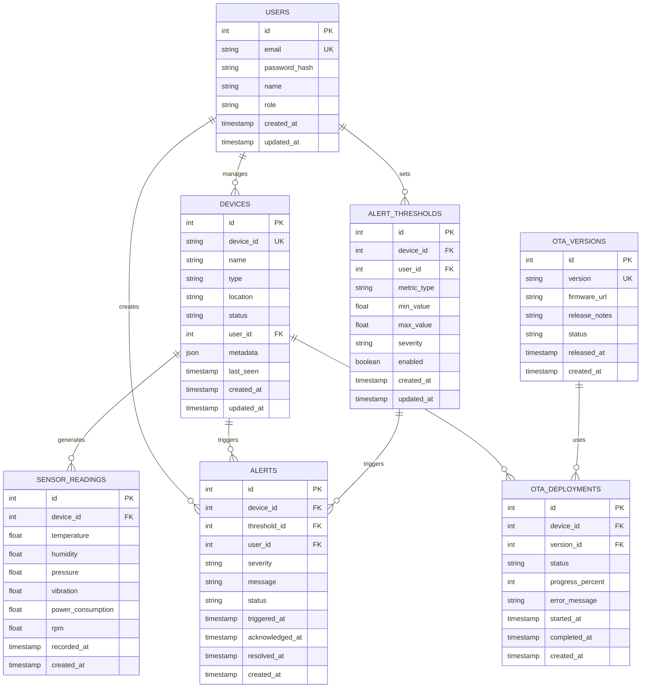

# Smart Factory IoT - Database Schema

## Entity Relationship Diagram



## Table Specifications

### USERS
Stores user account information and authentication credentials.

| Column | Type | Constraints | Description |
|--------|------|-------------|-------------|
| id | INT | PRIMARY KEY, AUTO_INCREMENT | Unique user identifier |
| email | VARCHAR(255) | UNIQUE, NOT NULL | User email address |
| password_hash | VARCHAR(255) | NOT NULL | Bcrypt hashed password |
| name | VARCHAR(255) | NOT NULL | User full name |
| role | ENUM | NOT NULL | User role (admin, operator, user) |
| created_at | TIMESTAMP | NOT NULL | Account creation time |
| updated_at | TIMESTAMP | NOT NULL | Last update time |

### DEVICES
Represents IoT devices in the factory.

| Column | Type | Constraints | Description |
|--------|------|-------------|-------------|
| id | INT | PRIMARY KEY, AUTO_INCREMENT | Unique device identifier |
| device_id | VARCHAR(255) | UNIQUE, NOT NULL | Device hardware ID |
| name | VARCHAR(255) | NOT NULL | Device display name |
| type | VARCHAR(100) | NOT NULL | Device type (sensor, gateway, etc.) |
| location | VARCHAR(255) | NOT NULL | Physical location |
| status | ENUM | NOT NULL | Device status (online, offline, error) |
| user_id | INT | FOREIGN KEY | Owner user ID |
| metadata | JSON | | Additional device information |
| last_seen | TIMESTAMP | | Last communication timestamp |
| created_at | TIMESTAMP | NOT NULL | Creation time |
| updated_at | TIMESTAMP | NOT NULL | Last update time |

### SENSOR_READINGS
Time-series data from device sensors.

| Column | Type | Constraints | Description |
|--------|------|-------------|-------------|
| id | INT | PRIMARY KEY, AUTO_INCREMENT | Unique reading identifier |
| device_id | INT | FOREIGN KEY, NOT NULL | Associated device |
| temperature | FLOAT | | Temperature in Celsius |
| humidity | FLOAT | | Humidity percentage |
| pressure | FLOAT | | Pressure in kPa |
| vibration | FLOAT | | Vibration level |
| power_consumption | FLOAT | | Power in Watts |
| rpm | FLOAT | | Rotations per minute |
| recorded_at | TIMESTAMP | NOT NULL | Sensor reading timestamp |
| created_at | TIMESTAMP | NOT NULL | Record creation time |

**Indexes:**
- `device_id, recorded_at` (composite index for time-series queries)
- `recorded_at` (for time range queries)

### ALERTS
System alerts triggered by threshold violations.

| Column | Type | Constraints | Description |
|--------|------|-------------|-------------|
| id | INT | PRIMARY KEY, AUTO_INCREMENT | Unique alert identifier |
| device_id | INT | FOREIGN KEY, NOT NULL | Associated device |
| threshold_id | INT | FOREIGN KEY | Triggered threshold |
| user_id | INT | FOREIGN KEY | Alert owner |
| severity | ENUM | NOT NULL | Severity level (critical, warning, info) |
| message | TEXT | NOT NULL | Alert description |
| status | ENUM | NOT NULL | Alert status (active, acknowledged, resolved) |
| triggered_at | TIMESTAMP | NOT NULL | Alert trigger time |
| acknowledged_at | TIMESTAMP | | Acknowledgment time |
| resolved_at | TIMESTAMP | | Resolution time |
| created_at | TIMESTAMP | NOT NULL | Record creation time |

**Indexes:**
- `user_id, created_at` (for user alert queries)
- `status, severity` (for alert filtering)

### ALERT_THRESHOLDS
Configuration for alert triggers.

| Column | Type | Constraints | Description |
|--------|------|-------------|-------------|
| id | INT | PRIMARY KEY, AUTO_INCREMENT | Unique threshold identifier |
| device_id | INT | FOREIGN KEY, NOT NULL | Associated device |
| user_id | INT | FOREIGN KEY, NOT NULL | Threshold owner |
| metric_type | VARCHAR(100) | NOT NULL | Metric being monitored |
| min_value | FLOAT | | Minimum acceptable value |
| max_value | FLOAT | | Maximum acceptable value |
| severity | ENUM | NOT NULL | Alert severity level |
| enabled | BOOLEAN | NOT NULL | Whether threshold is active |
| created_at | TIMESTAMP | NOT NULL | Creation time |
| updated_at | TIMESTAMP | NOT NULL | Last update time |

### OTA_VERSIONS
Firmware version management.

| Column | Type | Constraints | Description |
|--------|------|-------------|-------------|
| id | INT | PRIMARY KEY, AUTO_INCREMENT | Unique version identifier |
| version | VARCHAR(50) | UNIQUE, NOT NULL | Version number (semver) |
| firmware_url | VARCHAR(500) | NOT NULL | Download URL |
| release_notes | TEXT | | Version release notes |
| status | ENUM | NOT NULL | Version status (draft, released, deprecated) |
| released_at | TIMESTAMP | | Release timestamp |
| created_at | TIMESTAMP | NOT NULL | Creation time |

### OTA_DEPLOYMENTS
Tracks firmware update deployments to devices.

| Column | Type | Constraints | Description |
|--------|------|-------------|-------------|
| id | INT | PRIMARY KEY, AUTO_INCREMENT | Unique deployment identifier |
| device_id | INT | FOREIGN KEY, NOT NULL | Target device |
| version_id | INT | FOREIGN KEY, NOT NULL | Firmware version |
| status | ENUM | NOT NULL | Deployment status (pending, in_progress, completed, failed) |
| progress_percent | INT | | Update progress (0-100) |
| error_message | TEXT | | Error details if failed |
| started_at | TIMESTAMP | | Deployment start time |
| completed_at | TIMESTAMP | | Deployment completion time |
| created_at | TIMESTAMP | NOT NULL | Record creation time |

**Indexes:**
- `device_id, status` (for device deployment queries)
- `version_id, status` (for version deployment tracking)

## Query Patterns

### Real-time Sensor Data
```sql
SELECT * FROM SENSOR_READINGS
WHERE device_id = ? AND recorded_at > NOW() - INTERVAL 1 HOUR
ORDER BY recorded_at DESC
LIMIT 100;
```

### Active Alerts
```sql
SELECT a.*, d.name as device_name, u.email as user_email
FROM ALERTS a
JOIN DEVICES d ON a.device_id = d.id
JOIN USERS u ON a.user_id = u.id
WHERE a.status = 'active'
ORDER BY a.severity DESC, a.triggered_at DESC;
```

### Device Status Overview
```sql
SELECT 
    d.id, d.name, d.status,
    COUNT(CASE WHEN a.status = 'active' THEN 1 END) as active_alerts,
    MAX(sr.recorded_at) as last_reading
FROM DEVICES d
LEFT JOIN ALERTS a ON d.id = a.device_id
LEFT JOIN SENSOR_READINGS sr ON d.id = sr.device_id
GROUP BY d.id;
```

## Performance Optimization

### Indexing Strategy
- Primary keys on all tables
- Foreign key indexes for joins
- Composite indexes for common queries
- Timestamp indexes for time-range queries

### Query Optimization
- Use EXPLAIN to analyze queries
- Avoid N+1 queries with proper joins
- Batch operations for bulk updates
- Pagination for large result sets

### Caching Strategy
- Cache frequently accessed thresholds
- Cache device metadata
- Cache user roles and permissions
- Invalidate cache on updates

## Data Retention Policy

| Table | Retention | Archive |
|-------|-----------|---------|
| USERS | Indefinite | N/A |
| DEVICES | Indefinite | N/A |
| SENSOR_READINGS | 90 days | Archive to S3 |
| ALERTS | 1 year | Archive to S3 |
| ALERT_THRESHOLDS | Indefinite | N/A |
| OTA_VERSIONS | Indefinite | N/A |
| OTA_DEPLOYMENTS | 1 year | Archive to S3 |

## Backup & Recovery

### Backup Strategy
- Daily incremental backups
- Weekly full backups
- Backup retention: 30 days
- Off-site backup storage

### Recovery Procedure
1. Identify recovery point
2. Restore from backup
3. Verify data integrity
4. Sync with replicas
5. Resume operations

## Security Considerations

### Data Protection
- Encrypt sensitive fields at rest
- Use parameterized queries to prevent SQL injection
- Implement row-level security for multi-tenant data
- Audit all data modifications

### Access Control
- Role-based access to data
- User can only see their own devices
- Admin can see all data
- Operator has read-only access

### Compliance
- GDPR compliance for user data
- Data anonymization for deleted users
- Audit logs for all modifications
- Encryption in transit (HTTPS/TLS)
