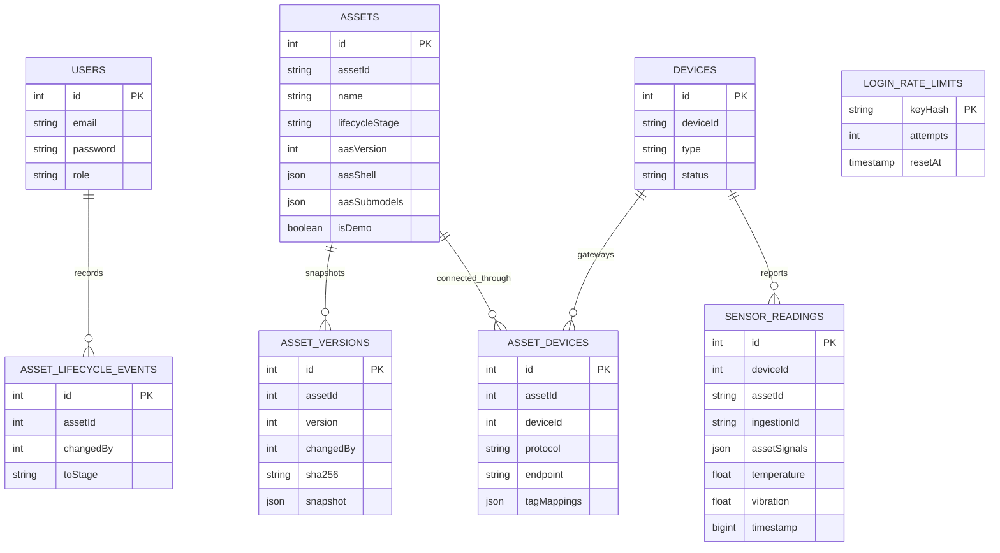
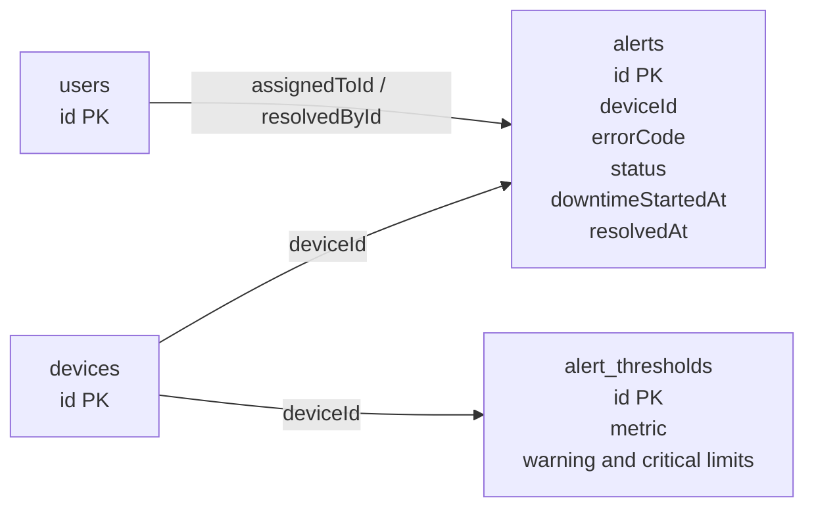

# Application Database Schema

The dashboard uses PostgreSQL with Drizzle ORM. The source of truth is drizzle/schema.ts; checked-in SQL migrations live in drizzle/.

```mermaid
erDiagram
  USERS ||--o{ ASSET_LIFECYCLE_EVENTS : records
  ASSETS ||--o{ ASSET_VERSIONS : snapshots
  ASSETS ||--o{ ASSET_DEVICES : connected_through
  DEVICES ||--o{ ASSET_DEVICES : gateways
  DEVICES ||--o{ SENSOR_READINGS : reports
  USERS {
    int id PK
    string email
    string password
    string role
  }
  ASSETS {
    int id PK
    string assetId
    string name
    string lifecycleStage
    int aasVersion
    json aasShell
    json aasSubmodels
    boolean isDemo
  }
  ASSET_DEVICES {
    int id PK
    int assetId
    int deviceId
    string protocol
    string endpoint
    json tagMappings
  }
  ASSET_LIFECYCLE_EVENTS {
    int id PK
    int assetId
    int changedBy
    string toStage
  }
  ASSET_VERSIONS {
    int id PK
    int assetId
    int version
    int changedBy
    string sha256
    json snapshot
  }
  LOGIN_RATE_LIMITS {
    string keyHash PK
    int attempts
    timestamp resetAt
  }
  DEVICES {
    int id PK
    string deviceId
    string type
    string status
  }
  SENSOR_READINGS {
    int id PK
    int deviceId
    string assetId
    string ingestionId
    json assetSignals
    float temperature
    float vibration
    bigint timestamp
  }
```

## Incident response and downtime records

```mermaid
flowchart LR
  Users[users<br/>id PK] -->|assignedToId / resolvedById| Alerts[alerts<br/>id PK<br/>deviceId<br/>errorCode<br/>status<br/>downtimeStartedAt<br/>resolvedAt]
  Devices[devices<br/>id PK] -->|deviceId| Alerts
  Devices -->|deviceId| Thresholds[alert_thresholds<br/>id PK<br/>metric<br/>warning and critical limits]
```

Threshold-generated incidents use stable `SF-*` platform classifications. A vendor diagnostic code is stored as supplied when available. The engineer role provides technician assignment and resolution permissions; downtime is explicitly confirmed by the assigned engineer or administrator. A lost device connection does not automatically prove a factory outage. Existing records inferred by migration 0010 need operational review before use in downtime KPIs. Mean downtime-to-resolution uses only records with both downtime and resolution timestamps.

| Table | Purpose |
|---|---|
| users | Local identity, bcrypt password hash in `password`, role, and sign-in timestamps. Never expose the hash in API responses. |
| devices | Edge devices/gateways, status, location, firmware, and simulator marker. |
| assets | Equipment identity, manufacturer name/designation, separate required postal fields, article and order codes, optional serial/rated values, lifecycle, current AAS JSON, monotonic AAS revision, and simulator marker. |
| asset_devices | Asset-to-gateway protocol, endpoint, and tag/register mappings. Store credentials on the edge gateway, not in mappings. |
| asset_lifecycle_events | Actor, transition, timestamp, and engineering note audit history. |
| asset_versions | Append-only AAS snapshots keyed by asset and revision, with change note, actor, and SHA-256 integrity digest. Migration baseline rows have no digest because prior revisions were not recorded. |
| login_rate_limits | Hashed IP/email identifiers, fixed-window counters, and expiration timestamps shared across application replicas. |
| sensor_readings | Nullable measurements, AAS asset attribution, named signals, Unix epoch millisecond timestamps, and a unique ingestion digest for retry deduplication. Indexes cover asset/date and device/date queries. |
| alerts | Stable platform/vendor error code, severity/status, metric observation, acknowledging actor/time, assigned engineer/time, confirmed downtime start, resolving actor/time, and lifecycle timestamps. Per-source transaction locks deduplicate threshold incidents by device/asset/metric; query indexes cover status/date and assignee/status. |
| alert_thresholds | Enabled per-device warning and critical bands used to classify telemetry into incidents. |
| firmware_versions, ota_deployments | Firmware catalog metadata and legacy rollout rows. OTA is disabled; a rollout row is not proof that a device downloaded, verified, installed, or booted a release. |

Connection and lifecycle ids are application-level relationships, not database-enforced foreign keys in the current schema. The external AAS service owns separate storage. Demo rows are marked isDemo and are API-seeded only when demo data is enabled and no real assets exist.

Review migration SQL before applying changes. Set DATABASE_URL to the intended database before running pnpm db:migrate. pnpm e2e uses its own disposable PostgreSQL container.

## Durable incident notifications

Migration `0013_incident_notifications` adds `notification_inbox` and an alert trigger. In the alert transaction, new warning/critical incidents and critical escalations notify current engineers/admins; assignment changes notify new/previous assignees and admins; resolution notifies the assigned technician/admins. The trigger does not backfill historical incidents or emit duplicate messages on unrelated incident updates.

Each row belongs to one account, links to its alert and retains title/body, read time, email status, attempts, next attempt time, safe error summary and Resend acceptance time. Foreign-key cascades remove its rows when the associated account/alert is deleted. The delivery worker atomically claims due rows using a two-minute lease and retries after a crash. `accepted` means the Resend request was accepted, not that the email reached a mailbox. Eight failed attempts become `failed`; an authorized owner may retry after correcting configuration. `unconfigured` and `no_recipient` remain visible.

The inbox is queryable only by its owner. Reads do not acknowledge/resolve the factory incident. The Resend API key, sender and recipient-domain policy are runtime secrets/configuration, not editable browser notification settings. Plan retention/archive policies for both telemetry and inbox history before long-term production operation.

Migration `0014_account_email_identity` adds a case-insensitive unique email index. Null emails remain allowed for legacy identity records. Existing duplicate case-folded email addresses must be reconciled by an administrator before migration. Production self-registration is closed; further accounts are created by an authenticated administrator after private first-admin bootstrap. Passwords are never included in account API responses.
